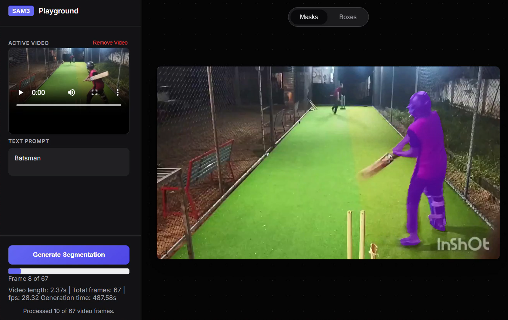
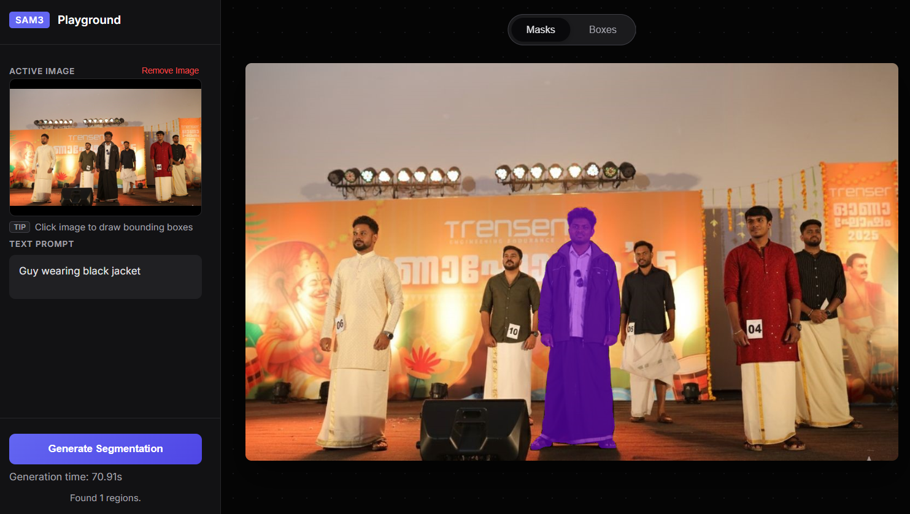

# SAM3 Playground

Fun with SAM3

## Video Segmentation Preview



## Image Segmentation Preview



## Setup

### Prerequisites
1. Create and activate a virtual environment with uv:

   ```
   uv venv
   .venv\Scripts\activate
   ```

2. Export your Hugging Face token that has access to SAM3 model files:

   ```
   $env:HF_TOKEN="<your_huggingface_token>"
   ```

3. Install all dependencies listed in pyproject.toml

   ```
   uv sync
   ```

4. Install project as package for development:
   ```
   uv pip install -e .
   ```

## Quickstart

- Start UI: `uvicorn sam3.ui:app --reload`

## UI info

Most of it was created by gemini 3